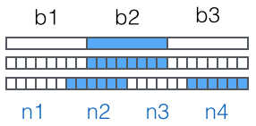
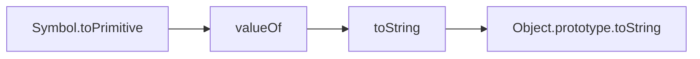

[TOC]
# what
## console

### assert 断言

### count countReset

### clear


### error

### group

### trace

### 

### 

### 

### 

## Object

### Object.is()
它用来比较两个值是否严格相等，与严格比较运算符（===）的行为基本一致。不同之处只有两个：一是+0不等于-0，二是NaN等于自身。
```js
+0 === -0 //true
NaN === NaN // false

Object.is(+0, -0) // false
Object.is(NaN, NaN) // true
```
### Object.assign()
用于对象的合并，将源对象（source）的所有可枚举属性，复制到目标对象（target）
```js
let a = {a: 1}, b = {a: 11,b: 2}, c = {c: 3};
Object.assign(a, b) //=>{a: 11, b: 2}
Object.assign(a, c) === a // => true
```

## Symbol
表示独一无二的值。
注意，Symbol函数前不能使用new命令，否则会报错。这是因为生成的 Symbol 是一个原始类型的值，不是对象。也就是说，由于 Symbol 值不是对象，所以不能添加属性。基本上，它是一种类似于字符串的数据类型。
```js
let s = Symbol();
let s1 = Symbol('foo');
```
- Symbol函数前不能使用`new`命令
- 不能与其他类型的值进行运算，但是可以显式转为字符串，可以转为布尔值，但是不能转为数值
- 该属性不会出现在`for...in`、`for...of`循环中。也不会被`Object.keys()`、`Object.getOwnPropertyNames()`、`JSON.stringify()`返回
- 不是私有属性，有一个`Object.getOwnPropertySymbols()`方法，可以获取指定对象的所有` Symbol` 属性名。`Reflect.ownKeys()`方法也可以
- 

## Iterator
Iterator 接口的目的，就是为所有数据结构，提供了一种统一的访问机制，即for...of循环。当使用for...of循环遍历某种数据结构时，该循环会自动去寻找 Iterator 接口。一种数据结构只要部署了 Iterator 接口，我们就称这种数据结构是“可遍历的”（iterable）。
默认的 Iterator 接口部署在数据结构的Symbol.iterator属性，或者说，一个数据结构只要具有Symbol.iterator属性，就可以认为是“可遍历的”。
```js
Symbol.iterator // => Symbol(Symbol.iterator)
arr = [1,2,3]
let iter = arr[Symbol.iterator]()
iter.next() // => {value: 1, done: false}
iter.next() // => {value: 2, done: false}
iter.next() // => {value: undefined, done: true}

for(let ele of arr){console.log(ele)} // => 1 2 3
```
Array、Map、Set、String、TypedArray、函数的 arguments 对象、NodeList 对象

自定义iterator，可以使用forof
```js
let arr = [1 ,2, 3]
let obj = {a: 1, b: 2}

obj[Symbol.iterator] = function idMaker() {
    var index = 0;
    let keys = Object.keys(this)
  
    return {
      next: function() {
          if(index < keys.length) {
            return {value: keys[index++], done: false};
          }else {
            return {value: undefined, done: true};
          }
      }
    };
  }

for (const iterator of obj) {
    console.log(iterator)
}
// => a b
```
for...of、Array.from()、Map()、Set()、WeakMap()、WeakSet()（比如new Map([['a',1],['b',2]])）、Promise.all()、Promise.race()

除了for...of循环以外，扩展运算符（...）、解构赋值和Array.from方法内部调用的，都是遍历器接口。这意味着，它们都可以将 Generator 函数返回的 Iterator 对象，作为参数。

## window.btoa  window.atob
- btoa ASCII 的二进制数据的单个字节 ->  Base64 表示的字符串
```js
window.btoa("F") // => "Rg=="
window.atob("Rg==") // => "F"
```

## base64
Base64是一种用64个字符来表示任意二进制数据的方法。

首先，准备一个包含64个字符的数组：
['A', 'B', 'C', ... 'a', 'b', 'c', ... '0', '1', ... '+', '/']
```js
Number.parseInt("111111", 2) // => 63
```
字符串一字节8比特
base64一个字符对应6比特
所以三个字符串对应base64编码后4个字符串，长度增加33%。




### 小结
Base64是一种任意二进制到文本字符串的编码方法，常用于在URL、Cookie、网页中传输少量二进制数据。

## async
是 Generator 函数的语法糖
- await命令后面是一个 Promise 对象，返回该对象的结果
- 如果不是 Promise 对象，就直接返回对应的值
- await命令后面是一个thenable对象（即定义then方法的对象），那么await会将其等同于 Promise 对象
```js
// 1 Promise 对象
function sleep(time = 1000) {
  return new Promise((resolve) => {
    setTimeout(() => {
      resolve(time)
    }, time);
  })
}

async function fetch() {
  console.log('1')
  await sleep()
  console.log('3')
}

fetch() // => 1 1s后 3

// 2 普通对象
async function f() {
  // 等同于
  // return 123;
  return await 123;
}

f().then(v => console.log(v))

// 3 thenable对象
class Sleep {
  constructor(timeout) {
    this.timeout = timeout;
  }
  then(resolve, reject) {
    const startTime = Date.now();
    setTimeout(
      () => resolve(Date.now() - startTime),
      this.timeout
    );
  }
}

(async () => {
  const sleepTime = await new Sleep(1000);
  console.log(sleepTime);
})();
// 1000
```
**thenable：** await命令后面是一个Sleep对象的实例。这个实例不是 Promise 对象，但是因为定义了then方法，await会将其视为Promise处理

## 对象原始类型转换



```js
Symbol.toPrimitive // => Symbol(Symbol.toPrimitive)
obj = {[Symbol.toPrimitive](){return 1}, value: 2, valueOf(){return 3}, toString(){return 4}}
obj+1 //=> 2
obj = {value: 2, valueOf(){return 3}, toString(){return 4}}
obj+1 //=> 4
obj = {value: 2, toString(){return 4}}
obj+1 //=> 5
obj = {value: 2}
obj+1 //=> "[object Object]1"
```
## RegExp

### exec
exec() 方法在一个指定字符串中执行一个搜索匹配。返回一个结果数组或 null。
当正则表达式使用 "g" 标志时，可以多次执行 exec 方法来查找同一个字符串中的成功匹配。当你这样做时，查找将从正则表达式的 lastIndex 属性指定的位置开始。
属性、索引|描述
--|--
`[0]`|匹配的全部字符串
`[1], ...[n ]`|括号中的分组捕获
`index`|匹配到的字符位于原始字符串的基于0的索引值
`input`|原始字符串

```js
reg=/ssd/g
str='123ssd445678ssd'
console.log(reg.exec(str)) // => ["ssd", index: 3, input: "123ssd445678ssd", groups: undefined]
console.log(reg.exec(str)) // => ["ssd", index: 12, input: "123ssd445678ssd", groups: undefined]
console.log(reg.exec(str)) // => null
console.log(reg.exec(str)) // => ["ssd", index: 3, input: "123ssd445678ssd", groups: undefined]

reg=/(\d+)([a-z]+)/g
str='123ssd445678ssd'
console.log(reg.exec(str)) // => ["123ssd", "123", "ssd", index: 0, input: "123ssd445678ssd", groups: undefined]
console.log(reg.exec(str)) // => ["445678ssd", "445678", "ssd", index: 6, input: "123ssd445678ssd", groups: undefined]
console.log(reg.exec(str)) // => null
console.log(reg.exec(str)) // => ["123ssd", "123", "ssd", index: 0, input: "123ssd445678ssd", groups: undefined]
```
### `RegExp.lastIndex`
lastIndex 是正则表达式的一个可读可写的整型属性，用来指定下一次匹配的起始索引。只有正则表达式使用了表示全局检索的 "g" 标志时，该属性才会起作用。
- 如果 lastIndex 大于字符串的长度，则 regexp.test 和 regexp.exec 将会匹配失败，然后 lastIndex 被设置为 0。
- 如果 lastIndex 等于字符串的长度，且该正则表达式匹配空字符串，则该正则表达式匹配从 lastIndex 开始的字符串。（then the regular expression matches input starting at lastIndex.）
- 如果 lastIndex 等于字符串的长度，且该正则表达式不匹配空字符串 ，则该正则表达式不匹配字符串，lastIndex 被设置为 0.。
- 否则，lastIndex 被设置为紧随最近一次成功匹配的下一个位置。

### RegExp.prototype[Symbol.matchAll]
返回一个迭代器。
```js
var re = /[0-9]+/g;
var str = '2016-01-02';
var result = re[Symbol.matchAll](str);

console.log(Array.from(result, x => x[0])); 
// ["2016", "01", "02"]
```
### RegExp.prototype[Symbol.match]
返回一个数组，它包括整个匹配结果，和通过捕获组匹配到的结果，如果没有匹配到则返回null
```js
var re = /[0-9]+/g;
var str = '2016-01-02';
var result = re[Symbol.match](str);
console.log(result);  // ["2016", "01", "02"]
```
密码强度正则，最少6位，包括至少1个大写字母，1个小写字母，1个数字，1个特殊字符
`/^.*(?=.{6,})(?=.*\d)(?=.*[A-Z])(?=.*[a-z])(?=.*[!@#$%^&*? ]).*$/`

## window
[document与window的区别](https://blog.csdn.net/qq_41805715/article/details/89042363)
### `alert`、`confirm`、`prompt`

### Navigator
`userAgent`
```
chrome:
    Mozilla/5.0 
    (Macintosh; Intel Mac OS X 10_12_6) 
    AppleWebKit/537.36 (KHTML, like Gecko) 
    Chrome/61.0.3163.91 Safari/537.36
safari:
    Mozilla/5.0 
    (Macintosh; Intel Mac OS X 10_12_6) 
    AppleWebKit/604.1.38 (KHTML, like Gecko) Version/11.0 
    Safari/604.1.38
ios11刘海X:
    Mozilla/5.0 
    (iPhone; CPU iPhone OS 11_0 like Mac OS X) 
    AppleWebKit/604.1.38 (KHTML, like Gecko) 
    Version/11.0 Mobile/15A372 Safari/604.1
ipad：
    Mozilla/5.0 
    (iPad; CPU OS 9_1 like Mac OS X) 
    AppleWebKit/601.1.46 (KHTML, like Gecko)
    Version/9.0 Mobile/13B143 Safari/601.1
galxy sansum:
    Mozilla/5.0 
    (Linux; Android 5.0; SM-G900P Build/LRX21T) 
    AppleWebKit/537.36 (KHTML, like Gecko) 
    Chrome/61.0.3163.91 Mobile Safari/537.36
安装uc浏览器：
    Mozilla/5.0 
    (Linux; U; Android 6.0.1; zh-CN; Mi Note 2 Build/MXB48T)
    AppleWebKit/537.36 (KHTML, like Gecko) Version/4.0 
    Chrome/40.0.2214.89 UCBrowser/11.4.9.941 Mobile Safari/537.36
winphone:
    Mozilla/5.0 
    (Linux; Android 5.1.1; Nexus 6 Build/LYZ28E) 
    AppleWebKit/537.36 (KHTML, like Gecko) 
    Chrome/61.0.3163.91 Mobile Safari/537.36
hybrid方法的可能：
    Mozilla/5.0 
    (iPhone; CPU iPhone OS 11_0 like Mac OS X) 
    AppleWebKit/604.1.38 (KHTML, like Gecko) 
    Mobile/15A372 weibo/80011134
```

### iframe
contentDocument 容纳框架的内容的文档。
window.frames  frameList是一个frame对象的集合，它类似一个数组，有length属性且可以使用索引（[i]）来访问。
window.parent 返回当前窗口的父窗口对象
window.top 最顶层的窗口对象

### location
- assign
- replace
- href


