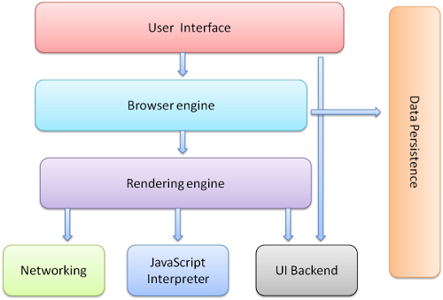

# [引擎与线程](https://hijiangtao.github.io/2018/01/08/JavaScript-and-Browser-Engines-with-Threads/)
操作dom是很消耗性能的，当页面需要大量的图标或者点线元素，会导致页面卡顿。
解决方案：
- 一般解决方案：svg->canvas
- 特殊解决方案：部分渲染
问题： 为什么呢？

## 浏览器功能介绍
1. 用户界面(User Interface)，除了DOM渲染的界面外都是用户界面。tab、地址、前进、后退、收藏
2. 浏览器引擎(Browser engine)
3. 呈现引擎(Rendering engine)，解析HTML、css并显示到屏幕上
4. 网络(Networking)，HTTP 请求
5. 用户界面后端(UI Backend)，
6. js解释器(JavaScript Interpreter)
7. 数据存储(Data Persistence)，在硬盘上保存各种数据

### 呈现引擎 Rendering engine
呈现引擎，又称渲染引擎，也被称为浏览器内核，在线程方面又称为 UI 线程，它是由各大浏览器厂商依照 W3C 标准自行研发的，常见的浏览器内核可以分这四种：Trident、Gecko、Blink、Webkit。
基本流程：

- 解析 HTML +CSS  -> DOM树+呈现树
- 布局 -> 分配屏幕上的确切坐标
- 绘制 -> 用户界面后端层将每个节点绘制出来
需要着重指出的是，这是一个渐进的过程。为达到更好的用户体验，呈现引擎会力求尽快将内容显示在屏幕上。它不必等到整个 HTML 文档解析完毕之后，就会开始构建呈现树和设置布局。在不断接收和处理来自网络的其余内容的同时，呈现引擎会将部分内容解析并显示出来。

### JavaScript 解释器
JavaScript 解释器就是能够“读懂” JavaScript 代码，并准确地给出代码运行结果的一段程序。也叫js解释器 - js解析引擎 - js引擎 - js内核 - js引擎线程
**例如**： Chrome 的 V8 引擎、IE9 的 Chakra、Firefox 的 TraceMonkey
**原理**：JavaScript 解释器基于事件驱动单线程执行的，JavaScript 引擎一直等待着任务队列中任务的到来，然后加以处理，浏览器无论什么时候都只有一个 JavaScript 线程在运行 JavaScript 程序。
- 静态语言：编译器（Compiler）
- 动态语言：解释器（Interpreter）

V8为了提高 JavaScript 的运行性能，会在运行之前将 JavaScript 编译为本地的机器码然后再去执行，这样速度就快很多
即时编译（Just In Time Compilation）

## 线程机制
### 单线程的 JavaScript
作为浏览器脚本语言，JavaScript 主要用于处理页面中用户交互，以及操作 DOM 树、CSS 样式树（当然也包括服务器逻辑的交互处理）。
Web Worker 真的让 JavaScript 拥有了多线程的能力吗？
为了利用多核 CPU 的计算能力，在 HTML5 中引入的工作线程使得浏览器端的 JavaScript 引擎可以并发地执行 JavaScript 代码，从而实现了对浏览器端多线程编程的良好支持。Web Worker 允许 JavaScript 脚本创建多个线程，但是子线程完全受主线程控制，且不得操作 DOM 。所以，这个新标准并没有改变 JavaScript 单线程的本质。
### 页面卡顿
由于 JavaScript 是可操纵 DOM 的，如果在修改这些元素属性同时渲染界面（即 JavaScript 线程和 UI 线程同时运行），那么渲染线程前后获得的元素数据就可能不一致了。为了防止渲染出现不可预期的结果，**浏览器设置 UI 渲染线程与 JavaScript 引擎线程为互斥的关系**，当 JavaScript 引擎线程执行时 UI 渲染线程会被挂起，UI 更新会被保存在一个队列中等到 JavaScript 引擎线程空闲时立即被执行。

假设一个 JavaScript 代码执行的时间过长，这样就会造成页面的渲染不连贯，导致页面渲染出现“加载阻塞”的现象。当然，针对 DOM 的大量操作也会造成页面出现卡顿现象，毕竟我们经常说：DOM 天生就很慢。

优化：
- 减少 JavaScript 加载对 DOM 渲染的影响
- 避免重排，减少重绘
- 减少 DOM 的层级
- 使用 requestAnimationFrame 来实现视觉变化（setTimeout 或 setInterval经常会使我们丢失帧，导致卡顿）
### 浏览器中的那些线程
- 浏览器事件触发线程
- 定时触发器线程
- 异步 HTTP 请求线程

