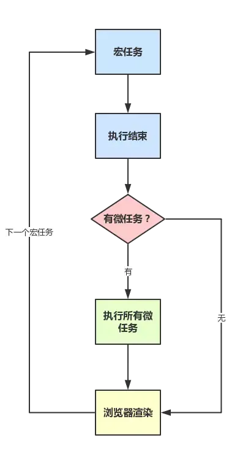

1. 什么是函数节流，为什么要使用函数节流，如何实现
2. 描述一下JS 的new操作符具体做了什么
3. 简述document和window两个对象区别
4. 从上至下先捕获然后从下至上冒泡
5. 函数柯里化
6. TCP
7. window.onload和document.ready的区别
8. iframe，如何在页面中改变另一个iframe的样式
9. 尽可能多的方法隐藏一个html元素
10. 盒模型,IE盒模型和标准盒模型，如何改变
11. 深拷贝和浅拷贝的定义


## 函数防抖 debounce---函数节流  throttle
函数防抖，就是指触发事件后在 n 秒内函数只能执行一次，如果在 n 秒内又触发了事件，则会重新计算函数执行时间。
函数节流，限制一个函数在一定时间内只能执行一次。
### 应用场景
函数防抖：
- 搜索框搜索输入。只需用户最后一次输入完，再发送请求
- 手机号、邮箱验证输入检测
- 窗口大小Resize。只需窗口调整完成后，计算窗口大小。防止重复渲染。

函数节流： 
- 滚动加载，加载更多或滚到底部监听
- 谷歌搜索框，搜索联想功能
- 高频点击提交，表单重复提交

前端开发过程中，有一些事件或者函数，会被频繁地触发（短时间按内多次触发），最常见的例如，onresize，scroll，mousemove ,mousehover 等，这些事件的触发频率很高，不做限制的话，有可能一秒之内执行几十次、几百次，如果在这些函数内部执行了其他函数

## 深拷贝和浅拷贝的定义
>浅拷贝: 
>创建一个新对象，这个对象有着原始对象属性值的一份精确拷贝。如果属性是基本类型，拷贝的就是基本类型的值，如果属性是引用类型，拷贝的就是内存地址 ，所以如果其中一个对象改变了这个地址，就会影响到另一个对象。
>深拷贝：
>将一个对象从内存中完整的拷贝一份出来,从堆内存中开辟一个新的区域存放新对象,且修改新对象不会影响原对象

### 乞丐版
`JSON.parse(JSON.stringify());`

### 生化版本
- 深层次拷贝，使用递归
- 考虑数组
- 循环引用
- 性能优化while -- forin -- for
- 其他数据类型（`Boolean`、`String`、`Number`、`null`、`undefined`、`Symbol`、`function`、`object`） `Object.prototype.toString.call(target)`
- 特殊对象 （`regexp`、``、``、``、``、``、``、）

## JS 的new操作符具体做了什么
1. 我们创建了一个空对象obj
2. 我们将这个空对象的proto成员指向了Base函数对象prototype成员对象
3. 我们将Base函数对象的this指针替换成obj


## 简述document和window两个对象区别
window: 它是一个顶层对象
document: 是window和frames对象的一个属性

## 从上至下先捕获然后从下至上冒泡
DOM事件流和 event的三个阶段（冒泡，捕捉，目标）

**基本概念**
event target 和 current event target
1. event target: 点击谁谁就是event target
2. current event target: 绑定给谁谁就是 current event target
capture、target、bubble phase
1. 捕获阶段capture：事件对象通过目标的祖先（windows）逐层往下遍历，直到target的父元素。这个过程就是捕获阶段。
2. 目标阶段target: 事件对象在目标的时候。（at target）.如果生命bubble属性不冒泡，则事件停止传播。
3. 冒泡阶段：事件对象反向（capture的反序），从目标的父元素开始往dom的祖先window传播。
**事件三个阶段该如何理解?**
step1: 你点击了页面，一定点击了window。所以时间对象最开始是在windows窗体产生的，并沿着dom树向下传播，正常的时间要经历上面三个阶段（circle）。
step2: 在传播过程中会遇到body,div,p等元素，每个元素上都可能绑定了一个listener监听器，监听经过的click事件。但是默认情况下capture捕获阶段，事件的handler是不会触发执行（看到了敌军但是按兵不动）。
step3: 默认事件在冒泡阶段执行，冒泡是由内向外的，所以冒泡阶段时间执行的顺序也是由内向外的。你点击了div，如果父元素也有click事件的监听器。那么先执行子元素的click事件handler，然后执行父元素的handler。
step4: addEventListener第三个参数可以设定为ture，意思是改变触发handler的顺序。这个listener在capture阶段捕获到时间后就执行。捕获阶段是从外向内向的，所以这样的监听器就会先执行父元素的handler.

**改变event flow**
1. 如果浏览器不支持其中某一个阶段，该阶段就被跳过。
2. 如果event.bubbles设定了false。冒泡阶段就不执行
3. 如果handler函数中调用了stopPropagation() ，那么三个阶段遇到此语句的时候就停止。

onclick 冒泡阶段执行。获取event   `window.event.stopPropagation()`

通过addEventListener可以给给以元素绑定多个handler。比如一个click事件可以触发多个函数。此时函数执行的顺序就是绑定的顺序。这里并不涉及事件的三个阶段，也不存在冒泡过程。仅仅handler触发后，js函数执行顺序的问题
## JavaScript [事件循环机制](https://www.jianshu.com/p/667a20d008cf)
javascript从诞生之日起就是一门单线程的非阻塞的脚本语言
单线程： 在执行的任何时候，都只有一个主线程来处理所有的任务
非阻塞：当代码需要进行一项异步任务的时候，主线程会挂起（pending）这个任务，然后在异步任务返回结果的时候再根据一定规则去执行相应的回调
试想一下 如果javascript是多线程的，那么当两个线程同时对dom进行一项操作，例如一个向其添加事件，而另一个删除了这个dom，此时该如何处理呢？因此，为了保证不会 发生类似于这个例子中的情景，javascript选择只用一个主线程来执行代码，这样就保证了程序执行的一致性。



## [MutationObserver](https://segmentfault.com/a/1190000012787829)--MutationEvent
变动观察器，字面上就可以理解这是用来观察Node（节点）变化的。
```html
<div id='target' class='block' name='target'>
    target的第一个子节点
    <p>
        <span>target的后代</span>
    </p>
</div>
<script>
    var target=document.getElementById('target');
    var i=0
    var observe=new MutationObserver(function (mutations,observe) {
        i++  
        console.log('MutationObserver', i)  // => 1
    });
    observe.observe(target,{ childList: true});
    target.appendChild(document.createTextNode('1'));
    target.appendChild(document.createTextNode('2'));
    target.appendChild(document.createTextNode('3'));
    console.log(i)   // => 0
</script>
```

## 函数柯里化


## 隐藏一个元素
CSS display的值是none。
type="hidden"的表单元素。
宽度和高度都显式设置为0。
一个祖先元素是隐藏的，该元素是不会在页面上显示
CSS visibility的值是hidden
CSS opacity的指是0
绝对定位，移出父元素边界

## [浏览器缓存](https://www.jianshu.com/p/f4dbaaebe902)

#### [强缓存](https://segmentfault.com/a/1190000016705679)
Cache-Control、Expires
#### 协商缓存
Last-Modified)或者资源的标签（Etag)
#### localstorage

## 前端性能优化
- 减少http请求（压缩、image雪碧图）
- 缓存
- cdn
- Lazy Load Javascript


