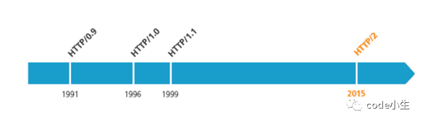
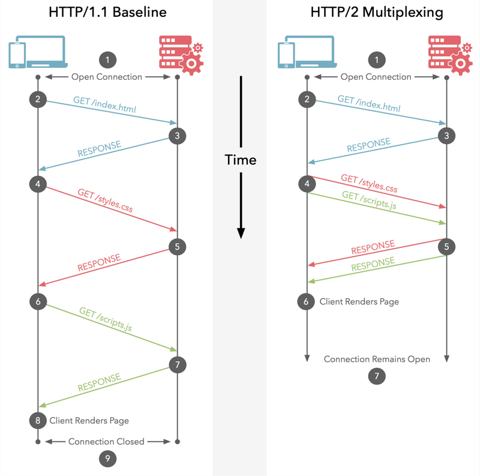
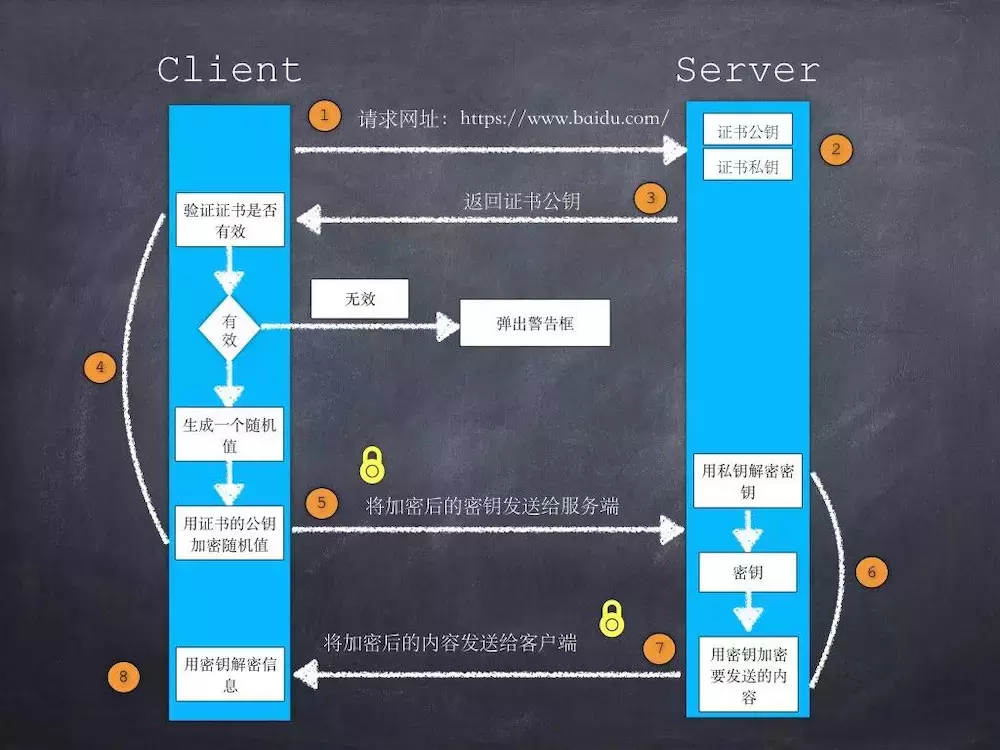

[TOC]
# http
HTTP（HyperText Transfer Protocol）是超文本传输协议，其定义了客户端与服务器端之间文本传输的规范。
HTTP默认使用80端口
HTTPS的默认端口为443
## 第一节、请求方法

方法|描述
--|--
GET|向特定的资源发出请求。GET方法不应当被用于产生“副作用”的操作中。大小1024字节
POST|向指定资源提交数据进行处理请求。（例如提交表单或者上传文件）POST 请求可能会导致新的资源的建立和/或已有资源的修改。
HEAD|HEAD和GET本质是一样的，区别在于HEAD不含有呈现数据，而仅仅是HTTP头信息。欲判断某个资源是否存在
PUT|将client的资源放在请求URI上。对于服务器到底是创建还是更新，由服务器返回的HTTP Code来区别。从客户端向服务器传送的数据取代指定的文档的内容。PUT通常指定了资源的存放位置，而POST则没有，POST的数据存放位置由服务器自己决定
DELETE|请求服务器删除指定的页面。
CONNECT|HTTP/1.1 协议中预留给能够将连接改为管道方式的代理服务器。
OPTIONS|允许客户端查看服务器的性能。
TRACE|回显服务器收到的请求，主要用于测试或诊断。
PATCH|是对 PUT 方法的补充，用来对已知资源进行局部更新

### PUT
这个方法比较少见。HTML表单也不支持这个。本质上来讲， PUT和POST极为相似，都是向服务器发送数据，但它们之间有一个重要区别，PUT通常指定了资源的存放位置，而POST则没有，POST的数据存放位置由服务器自己决定。
举个例子：如一个用于提交博文的URL，/addBlog。如果用PUT，则提交的URL会是像这样的”/addBlog/abc123”，其中abc123就是这个博文的地址。而如果用POST，则这个地址会在提交后由服务器告知客户端。目前大部分博客都是这样的。显然，PUT和POST用途是不一样的。具体用哪个还取决于当前的业务场景。
### OPTIONS
请求旨在发送一种“探测”请求以确定针对某个目标地址的请求必须具有怎样的约束（比如应该采用怎样的HTTP方法以及自定义的请求报头），然后根据其约束发送真正的请求。比如针对 **“跨域资源”** 的预检（Preflight）请求采用的HTTP方法就是OPTIONS。
该请求方法的响应不能缓存。
1、获取服务器支持的HTTP请求方法；也是黑客经常使用的方法。
2、用来检查服务器的性能。例如：AJAX进行跨域请求时的预检，需要向另外一个域名的资源发送一个HTTP OPTIONS请求头，用以判断实际发送的请求是否安全。

### CONNECT
http代理，SSL连接
HTTP CONNECT代理服务器是一种能够允许用户建立TCP连接到任何端口的代理服务器，这意味着这种代理不仅可用于HTTP，还包括FTP、IRC、RM流服务等，甚至扫描、攻击。

### TRACE
TRACE方法是HTTP（超文本传输）协议定义的一种协议调试方法，该方法使得服务器原样返回任何客户端请求的内容。 
启用TRACE方法存在如下风险： 
1、恶意攻击者可以通过TRACE方法返回的信息了解到网站前端的某些信息，如缓存服务器等，从而为进一步的攻击提供便利。 
2、恶意攻击者可以通过TRACE方法进行XSS攻击。 
3、即使网站对关键页面启用了HttpOnly头标记和禁止脚本读取cookie信息，但是通过TRACE 方法恶意攻击者还是可以绕过这个限制读取到cookie信息。

## 第二节、 [状态码](https://tool.lu/httpcode/)
状态码|描述
--|--
101|服务器已经理解了客户端的请求，并将通过Upgrade消息头通知客户端采用不同的协议来完成这个请求。
204|该响应没有响应内容,只有响应头,响应头也可能是有用的.
206|当客户端通过使用range头字段进行文件分段下载时使用该状态码
301|永久移动
302|临时移动
303|查看其它地址。与301类似。使用GET和POST请求查看
304|未修改。所请求的资源未修改，服务器返回此状态码时，不会返回任何资源。
305|使用代理。所请求的资源必须通过代理访问
307|临时重定向。与302类似。使用GET请求重定向
400|客户端请求的语法错误，服务器无法理解
401|请求要求用户的身份认证
403|服务器理解请求客户端的请求，但是拒绝执行此请求
404|服务器无法根据客户端的请求找到资源
405|客户端请求中的方法被禁止
500|服务器内部错误，无法完成请求
502|作为网关或者代理工作的服务器尝试执行请求时，从远程服务器接收到了一个无效的响应

## 第三节、 原理TCP
### 工作过程
- 地址解析
- 封装HTTP请求数据包
- 封装成TCP包，建立TCP连接（TCP的三次握手
- 客户机发送请求命令
- 服务器响应
- 服务器关闭TCP连接

### tcp
TCP三次握手/建立连接
TCP四次握手/终止连接
也不知道有什么用

## 第四节、 http & http2


### 性能
影响一个 HTTP 网络请求的因素主要有两个：带宽和延迟
- 带宽已经有极大的改善
- 延迟（浏览器最大连接数限制、DNS 查询、建立连接三次握手慢启动）

### 心路历程
[变化](https://www.cnblogs.com/heluan/p/8620312.html)
#### 缓存处理
HTTP1.0：If-Modified-Since,Expires来做为缓存判断的标准
HTTP1.1：Entity tag、If-Unmodified-Since、If-Match、 If-None-Match

HTTP1.1特性：
1. 引入了range头域
2. 新增了24个错误状态响应码
3. Host头域
4. 长连接，在HTTP1.1中默认开启Connection： keep-alive
#### range多线程下载工具
当用户在听一首歌的时候，如果听到一半（网络下载了一半），网络断掉了，用户需要继续听的时候，文件服务器不支持断点的话，则用户需要重新下载这个文件。而Range支持的话，客户端应该记录了之前已经读取的文件范围，网络恢复之后，则向服务器发送读取剩余Range的请求，服务端只需要发送客户端请求的那部分内容，而不用整个文件发送回客户端，以此节省网络带宽。
Server通过请求头中的Range: bytes=0-xxx来判断是否是做Range请求，如果这个值存在而且有效，则只发回请求的那部分文件内容，响应的状态码变成**206**，表示Partial Content，并设置Content-Range。如果无效，则返回**416**状态码，表明Request Range Not

### HTTP2特点
- http1.*基于文本，http2.0基于二进制格式
- 多路复用，即连接共享。**一个request对应一个id**，这样一个连接上可以有多个request，每个连接的request可以随机的混杂在一起，接收方可以根据request的 id将request再归属到各自不同的服务端请求里面。
- header压缩。对前面提到过HTTP1.x的header带有大量信息，而且每次都要重复发送，HTTP2.0使用encoder来减少需要传输的header大小，通讯双方各自cache一份header fields表，既避免了重复header的传输，又减小了需要传输的大小。
- 服务端推送
#### HTTP2 HPACK 头部压缩
我晕再看吧[HTTP2 HPACK 头部压缩](http://http2.github.io/http2-spec/compression.html)
#### HTTP2 与http1.1 keep-alive
必须等到服务端响应了前一次请求，才能发起第二次请求 -> 阻塞。 按顺序发送请求，按顺序接收请求，这样接收端才不会乱掉。
而 http2 的多路复用可以同时发送多个请求，不一定要按照顺序，也不用等上一个请求响应。这些请求都有唯一标识，所以可以无序。



## 第五节、 http && https
[HTTP和HTTPS协议](https://blog.csdn.net/xiaoming100001/article/details/81109617)
[HTTPS理论基础](https://blog.csdn.net/iispring/article/details/51615631)
[HTTPS加密（握手）过程](https://www.jianshu.com/p/e30a8c4fa329)
HTTPS协议 = HTTP协议 + SSL/TLS协议，在HTTPS数据传输的过程中，需要用SSL/TLS对数据进行加密和解密，需要用HTTP对加密后的数据进行传输，由此可以看出HTTPS是由HTTP和SSL/TLS一起合作完成的。
HTTPS为了兼顾安全与效率，同时使用了对称加密和非对称加密。数据是被对称加密传输的，对称加密过程需要客户端的一个密钥，为了确保能把该密钥安全传输到服务器端，采用非对称加密对该密钥进行加密传输，总的来说，对数据进行对称加密，对称加密所要使用的密钥通过非对称加密传输。
非对称加密：[RSA](https://blog.csdn.net/wjiabin/article/details/85228078)(质数)、[ECC](https://www.jianshu.com/p/980c7b679e65)(椭圆曲线)
对称加密：AES,DES,3DES


### HTTP特点:
1. 无状态：协议对客户端没有状态存储，对事物处理没有“记忆”能力，比如访问一个网站需要反复进行登录操作
2. 无连接：HTTP/1.1之前，由于无状态特点，每次请求需要通过TCP三次握手四次挥手，和服务器重新建立连接。比如某个客户机在短时间多次请求同一个资源，服务器并不能区别是否已经响应过用户的请求，所以每次需要重新响应请求，需要耗费不必要的时间和流量。
4. 基于请求和响应：基本的特性，由客户端发起请求，服务端响应
5. 简单快速、灵活
6. 通信使用明文、请求和响应不会对通信方进行确认、无法保护数据的完整性
### HTTPS特点:
1. 内容加密：采用混合加密技术，中间者无法直接查看明文内容
2. 验证身份：通过证书认证客户端访问的是自己的服务器
3. 保护数据完整性：防止传输的内容被中间人冒充或者篡改
## 第六节、 http && websocket
长轮询、短轮询
WebSocket是HTML5新增的协议，它的目的是在浏览器和服务器之间建立一个不受限的双向通信的通道，比如说，服务器可以在任意时刻发送消息给浏览器。
WebSocket并不是全新的协议，而是利用了HTTP协议来建立连接。
[WebSocket](https://www.liaoxuefeng.com/wiki/1022910821149312/1103303693824096)
### 请求
首先，WebSocket连接必须由浏览器发起，因为请求协议是一个标准的HTTP请求
```
GET ws://localhost:3000/ws/chat HTTP/1.1
Host: localhost
Upgrade: websocket
Connection: Upgrade
Origin: http://localhost:3000
Sec-WebSocket-Key: client-random-string
Sec-WebSocket-Version: 13
```
该请求和普通的HTTP请求有几点不同：
- **以ws://开头的地址**
- 请求头Upgrade: websocket和Connection: Upgrade表示这个连接将要被转换为WebSocket连接。**服务端返回状态码101**
- Sec-WebSocket-Key是用于标识这个连接，并非用于加密数据；
响应:
```
HTTP/1.1 101 Switching Protocols
Upgrade: websocket
Connection: Upgrade
Sec-WebSocket-Accept: server-random-string
```

为什么WebSocket连接可以实现全双工通信而HTTP连接不行呢？**实际上HTTP协议是建立在TCP协议之上的，TCP协议本身就实现了全双工通信**，但是HTTP协议的请求－应答机制限制了全双工通信。WebSocket连接建立以后，其实只是简单规定了一下：接下来，咱们通信就不使用HTTP协议了，直接互相发数据吧。


